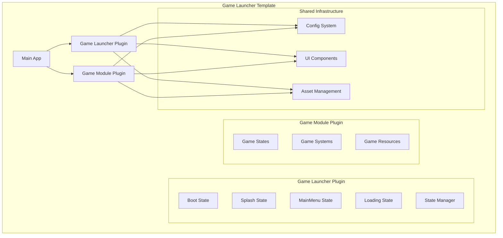

# Design Document: Game Launcher Template

## Overview

Данный дизайн описывает архитектурную реорганизацию игры на Rust/Bevy для создания переиспользуемого шаблона запуска игры. Основная цель - выделить систему запуска (Boot, Splash, MainMenu, Loading) в отдельный модуль-плагин, который можно легко переносить между проектами.

Архитектура основана на принципах модульности Bevy, используя систему плагинов для четкого разделения ответственности между системой запуска и игровой логикой. Это позволяет создать универсальный шаблон, работающий как для 2D, так и для 3D игр.

## Architecture

### High-Level Architecture



### Plugin Architecture

Архитектура построена на трех основных уровнях:

1. **Game Launcher Plugin** - переиспользуемый модуль запуска
2. **Game Module Plugin** - специфичная игровая логика
3. **Shared Infrastructure** - общие компоненты (конфигурация, UI, ресурсы)

### State Management Strategy

Используется расширенная система состояний Bevy с поддержкой данных в вариантах enum:

```rust
#[derive(Debug, Clone, PartialEq, Eq, Hash, States)]
pub enum AppState {
    // Launcher states - управляются Game Launcher Plugin
    Boot,
    Splash,
    MainMenu(MenuConfig),
    Loading(LoadingConfig),
    
    // Game states - управляются Game Module Plugin  
    InGame(GameConfig),
    Paused(GameConfig),
    GameOver(GameConfig),
}
```

## Components and Interfaces

### Game Launcher Plugin

**Основные компоненты:**

1. **LauncherPlugin** - главный плагин, регистрирующий все состояния запуска
2. **StateTransitionManager** - управляет переходами между состояниями
3. **LauncherConfig** - конфигурация поведения лаунчера
4. **GameIntegrationTrait** - трейт для интеграции с игровыми модулями

**Ключевые интерфейсы:**

```rust
pub trait GameModule: Plugin {
    /// Возвращает начальное игровое состояние
    fn initial_game_state(&self) -> AppState;
    
    /// Регистрирует игровые состояния
    fn register_game_states(&self, app: &mut App);
    
    /// Возвращает ресурсы, необходимые для загрузки
    fn required_assets(&self) -> Vec<AssetPath>;
}

pub struct LauncherConfig {
    pub show_splash: bool,
    pub splash_duration: Duration,
    pub enable_main_menu: bool,
    pub auto_start_game: bool,
    pub loading_screen_config: LoadingScreenConfig,
}
```

### State Implementations

**Boot State:**

- Инициализация базовых систем
- Загрузка конфигурации
- Проверка системных требований
- Переход к Splash или MainMenu

**Splash State:**

- Отображение логотипов/заставки
- Предварительная загрузка критических ресурсов
- Автоматический переход по таймеру

**MainMenu State:**

- Главное меню игры
- Настройки
- Выбор уровня/режима
- Переход к Loading

**Loading State:**

- Загрузка игровых ресурсов
- Отображение прогресса
- Переход к игровому состоянию

### Game Module Integration

**Интерфейс интеграции:**

```rust
pub struct GameModuleDescriptor {
    pub name: String,
    pub version: String,
    pub game_type: GameType, // 2D, 3D, Mixed
    pub required_features: Vec<String>,
}

pub enum GameType {
    TwoD,
    ThreeD,
    Mixed,
}
```

## Data Models

### Configuration Models

```rust
#[derive(Debug, Clone, Serialize, Deserialize, Resource)]
pub struct LauncherConfig {
    pub splash: SplashConfig,
    pub menu: MenuConfig,
    pub loading: LoadingConfig,
    pub integration: IntegrationConfig,
}

#[derive(Debug, Clone, Serialize, Deserialize)]
pub struct SplashConfig {
    pub enabled: bool,
    pub duration_ms: u64,
    pub logos: Vec<LogoConfig>,
    pub background_color: Color,
}

#[derive(Debug, Clone, Serialize, Deserialize)]
pub struct MenuConfig {
    pub enabled: bool,
    pub theme: String,
    pub show_settings: bool,
    pub show_credits: bool,
    pub custom_buttons: Vec<CustomButtonConfig>,
}

#[derive(Debug, Clone, Serialize, Deserialize)]
pub struct LoadingConfig {
    pub show_progress: bool,
    pub show_tips: bool,
    pub background_music: Option<String>,
    pub minimum_duration_ms: u64,
}
```

### State Data Models

```rust
#[derive(Debug, Clone, PartialEq, Eq, Hash)]
pub struct MenuData {
    pub selected_option: MenuOption,
    pub settings_open: bool,
}

#[derive(Debug, Clone, PartialEq, Eq, Hash)]
pub struct LoadingData {
    pub target_state: AppState,
    pub assets_to_load: Vec<AssetPath>,
    pub progress: f32,
}
```

### Asset Management Models

```rust
#[derive(Debug, Clone, Resource)]
pub struct LauncherAssets {
    pub splash_logos: Vec<Handle<Image>>,
    pub menu_background: Handle<Image>,
    pub ui_theme: Handle<UiTheme>,
    pub sounds: LauncherSounds,
}

#[derive(Debug, Clone)]
pub struct LauncherSounds {
    pub menu_music: Handle<AudioSource>,
    pub button_click: Handle<AudioSource>,
    pub transition: Handle<AudioSource>,
}
```

## Correctness Properties

*A property is a characteristic or behavior that should hold true across all valid executions of a system-essentially, a formal statement about what the system should do. Properties serve as the bridge between human-readable specifications and machine-verifiable correctness guarantees.*

### Property Reflection

После анализа всех требований выявлены следующие группы логически связанных свойств, которые можно объединить для устранения избыточности:

**Группа 1: Модульная изоляция**

- Свойства 1.2, 2.1, 2.2 можно объединить в одно комплексное свойство о независимости модулей

**Группа 2: Универсальность типов игр**

- Свойства 1.3, 3.1, 3.2 можно объединить в одно свойство о поддержке любых типов игр

**Группа 3: Расширяемость архитектуры**

- Свойства 4.1, 4.2, 4.3, 4.5 можно объединить в одно свойство о динамической расширяемости

**Группа 4: Совместимость с существующими компонентами**

- Свойства 5.1, 5.2, 5.3, 5.5 можно объединить в одно свойство о сохранении совместимости

**Группа 5: Тестируемость компонентов**

- Свойства 7.1, 7.2, 7.4, 7.5 можно объединить в одно свойство о изолированном тестировании

### Correctness Properties

Property 1: Launcher содержит все необходимые состояния запуска
*For any* Game Launcher Plugin, при инициализации он должен регистрировать все состояния: Boot, Splash, MainMenu, Loading
**Validates: Requirements 1.1**

Property 2: Модульная изоляция между лаунчером и игрой
*For any* Game Launcher Plugin и Game Module Plugin, они должны взаимодействовать только через определенные интерфейсы без прямых зависимостей от внутренней реализации друг друга
**Validates: Requirements 1.2, 2.1, 2.2, 2.5**

Property 3: Универсальная поддержка типов игр
*For any* Game Module (2D, 3D, Mixed), Game Launcher должен корректно инициализироваться и переходить к игровым состояниям без специфичных для типа игры компонентов
**Validates: Requirements 1.3, 3.1, 3.2, 3.3**

Property 4: Корректные переходы состояний
*For any* последовательность переходов состояний от Boot к игровым состояниям, State Manager должен выполнять их без ошибок и в правильном порядке
**Validates: Requirements 3.4, 3.5**

Property 5: Динамическая расширяемость архитектуры
*For any* новый Launch State или игровой плагин, система должна корректно интегрировать их без нарушения работы существующих компонентов
**Validates: Requirements 4.1, 4.2, 4.3, 4.4, 4.5**

Property 6: Совместимость с существующими компонентами
*For any* существующий компонент (конфигурация, UI, ресурсы), Game Launcher должен корректно с ним работать, сохраняя все функциональности
**Validates: Requirements 5.1, 5.2, 5.3, 5.4, 5.5**

Property 7: Соответствие конвенциям Bevy
*For any* компонент Plugin Architecture, он должен следовать стандартным конвенциям Bevy для плагинов, состояний и ресурсов
**Validates: Requirements 6.4**

Property 8: Изолированная тестируемость
*For any* компонент Game Launcher или Launch State, он должен поддерживать изолированное тестирование без зависимостей от игровой логики
**Validates: Requirements 7.1, 7.2, 7.3, 7.4, 7.5**

Property 9: Четко определенные интерфейсы интеграции
*For any* Game Module, интеграция с Game Launcher должна происходить через четко определенные трейты с полным набором необходимых методов
**Validates: Requirements 1.4, 8.1, 8.4**

## Error Handling

### State Transition Errors

**Недопустимые переходы состояний:**

- Система должна предотвращать переходы, нарушающие логику запуска (например, прямой переход от Boot к InGame)
- При попытке недопустимого перехода система должна логировать ошибку и оставаться в текущем состоянии
- Предоставляется механизм восстановления через возврат к безопасному состоянию (Boot)

**Отсутствующие игровые модули:**

- При попытке перехода к игровому состоянию без зарегистрированного игрового модуля система должна показать ошибку
- Предоставляется fallback к MainMenu с сообщением об ошибке

### Configuration Errors

**Некорректная конфигурация лаунчера:**

- При загрузке некорректной конфигурации используются значения по умолчанию
- Ошибки конфигурации логируются с указанием проблемных параметров
- Система продолжает работу с безопасными настройками

**Отсутствующие ресурсы:**

- При отсутствии критических ресурсов (логотипы, UI темы) используются встроенные fallback
- Некритические ресурсы могут быть пропущены без остановки работы

### Integration Errors

**Ошибки интеграции игровых модулей:**

- При некорректной реализации GameModule трейта система должна предоставить детальное сообщение об ошибке
- Неправильно зарегистрированные игровые состояния должны быть отклонены с логированием
- Система должна продолжать работу в режиме "только лаунчер" при критических ошибках интеграции

## Testing Strategy

### Dual Testing Approach

**Unit Tests:**

- Тестирование отдельных компонентов состояний (Boot, Splash, MainMenu, Loading)
- Проверка корректности конфигурационных структур и их валидации
- Тестирование интерфейсов интеграции с моками игровых модулей
- Проверка обработки ошибочных ситуаций и edge cases

**Property-Based Tests:**

- Минимум 100 итераций для каждого property теста
- Каждый тест должен ссылаться на соответствующее свойство из дизайна
- Формат тега: **Feature: game-launcher-template, Property {number}: {property_text}**

**Property Test Configuration:**

- Использование библиотеки `proptest` для Rust
- Генерация случайных конфигураций лаунчера для тестирования универсальности
- Создание случайных последовательностей переходов состояний
- Тестирование с различными типами игровых модулей (2D/3D/Mixed)

**Integration Testing:**

- Тестирование полного цикла запуска от Boot до игрового состояния
- Проверка совместимости с существующими компонентами проекта
- Тестирование в изолированной среде без игровой логики

**Mock Strategy:**

- Создание mock-реализаций GameModule трейта для тестирования
- Mock-объекты для тестирования различных сценариев загрузки ресурсов
- Симуляция ошибочных состояний для тестирования обработки ошибок

Каждое correctness property должно быть реализовано отдельным property-based тестом, обеспечивающим проверку универсальных свойств системы на широком спектре входных данных.
