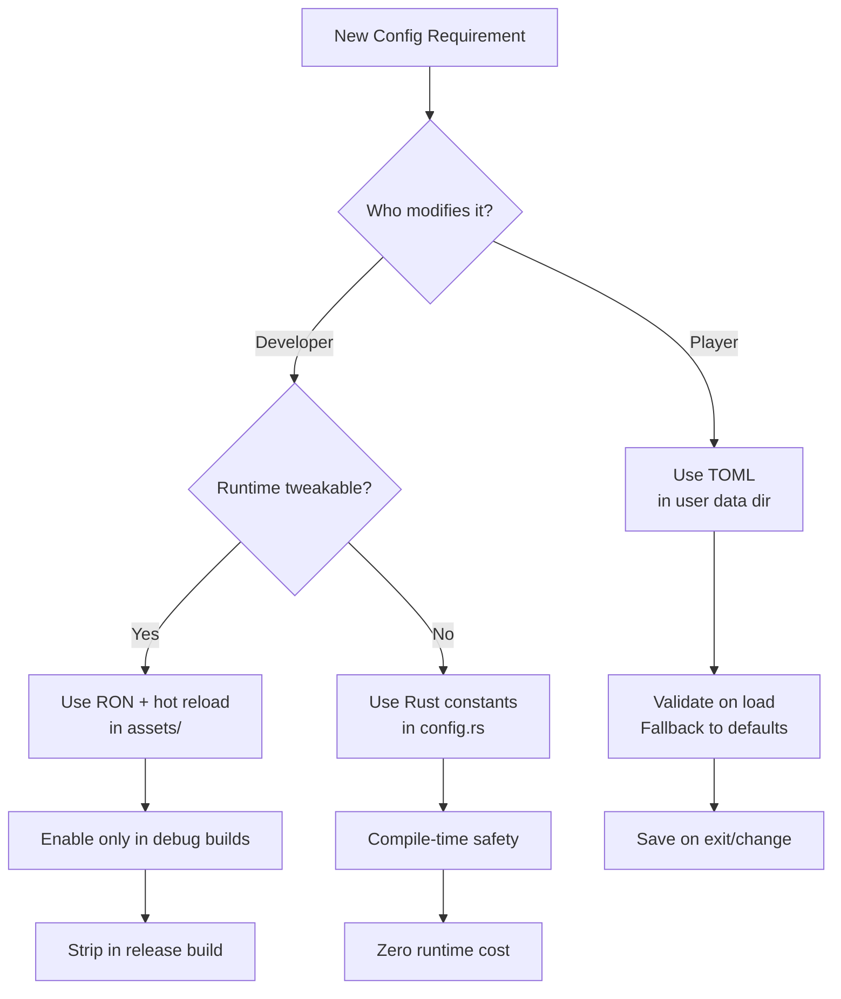

# Configuration Files Specification

## AI Agent Specification: Game Configuration Management System  

**Target Platform:** Rust + Bevy Engine Projects  
**Date:** January 30, 2026  

### 1. Executive Summary  

This specification defines an intelligent configuration management system for game projects built with Rust and Bevy. The agent must distinguish between **player-facing configurations** (runtime-tweakable, human-readable) and **developer-facing configurations** (build-time, security-sensitive), recommending optimal formats, storage locations, and validation strategies for each layer.

### 2. Core Principle: Dual-Layer Configuration Architecture  

| Layer | Audience | Purpose | Mutability | Security Sensitivity |
| ----- | -------- | ------- | ---------- | -------------------- |
| **Player Config** | End users | Customize gameplay experience (graphics, audio, controls) | Runtime-writable | Low (non-critical) |
| **Developer Config** | Engineers / QA | Engine tuning, feature flags, debug tools | Build-time / Editor-only | Medium-High (affects stability) |
| **Deployment Config** | DevOps / CI | Platform-specific settings (store IDs, analytics keys) | Pre-build injection | Critical (secrets) |

> 💡 **Key Insight**: Never conflate these layers. Player configs must survive game updates; developer configs should never ship to end users.

### 3. Format Selection Matrix  

| Format | Best For | Player-Friendly? | Dev-Friendly? | Rust Ecosystem Support | Security Risk |
| ------ | -------- | ---------------- | ------------- | ---------------------- | ------------- |
| **TOML** | Player configs, defaults | ✅ Excellent (comments, structure) | ✅ Good | `toml` crate (1st-party) | Low |
| **RON** | Debug saves, editor state | ⚠️ Moderate (Rust-like syntax) | ✅ Excellent (native types) | `ron` crate (Bevy-native) | Low |
| **JSON** | Machine-generated saves | ❌ Poor (no comments) | ⚠️ Moderate | `serde_json` | Medium (easy to corrupt) |
| **.env** | CI/CD secrets, local dev | ❌ Never expose to players | ✅ Dev-only | `dotenvy` | **Critical** (secrets leakage) |
| **Rust Code** (`config.rs`) | Compile-time constants | ❌ Requires rebuild | ✅ Type-safe | Native | None (compiled) |
| **Bincode** | Production saves | ❌ Binary (unreadable) | ⚠️ Debug-unfriendly | `bincode` | Low (opaque) |

### 4. Player Configuration Specification  

#### 4.1. Requirements  

- ✅ Human-editable with basic text editors (Notepad, TextEdit)  
- ✅ Survives game updates without reset  
- ✅ Validates gracefully on corruption (fallback to defaults)  
- ✅ Platform-compliant storage paths  

#### 4.2. Recommended Implementation  

```toml
# File: %APPDATA%/YourStudio/YourGame/config.toml (Windows)
#       ~/.config/your-studio/your-game/config.toml (Linux/macOS)

[graphics]
resolution = [1920, 1080]
fullscreen = false
vsync = true
# Quality: "Low" | "Medium" | "High" | "Ultra"
quality = "High"

[audio]
master_volume = 1.0   # Range: 0.0–1.0
music_volume = 0.7
sfx_volume = 0.8

[accessibility]
colorblind_mode = "none"  # "protanopia" | "deuteranopia" | "tritanopia"
subtitles = true
ui_scale = 1.0
```

#### 4.3. Storage Locations (Per Platform)  

| Platform | Path Template | Bevy Helper |
| -------- | ------------- | ----------- |
| Windows | `%APPDATA%\YourStudio\YourGame\` | `directories::ProjectDirs` |
| macOS | `~/Library/Application Support/com.yourstudio.yourgame/` | `directories::ProjectDirs` |
| Linux | `~/.config/your-studio/your-game/` | `directories::ProjectDirs` |
| Android | `/sdcard/Android/data/com.yourstudio.yourgame/files/` | `bevy::asset::AssetPath` |
| Web (WASM) | `IndexedDB` | `bevy_web::storage` |

> ⚠️ **Critical Rule**: Never store player configs in the game installation directory (violates Steam/Game Pass policies).

### 5. Developer Configuration Specification  

#### 5.1. Requirements  

- ✅ Hot-reloadable during development (`F5` refresh)  
- ✅ Editor-integrated (Bevy Inspector compatibility)  
- ✅ Version-controlled (in Git) with safe defaults  
- ✅ Never contains secrets or platform keys  

#### 5.2. Recommended Implementation  

```rust
// src/dev_config.rs
#[derive(Resource, Reflect, Debug, Clone)]
#[reflect(Resource)]
pub struct DevConfig {
    pub debug_physics: bool,
    pub show_fps: bool,
    pub asset_reload_watcher: bool,
    pub network_sim_latency_ms: u32,
}

impl Default for DevConfig {
    fn default() -> Self {
        Self {
            debug_physics: cfg!(debug_assertions),
            show_fps: false,
            asset_reload_watcher: cfg!(debug_assertions),
            network_sim_latency_ms: 0,
        }
    }
}
```

#### 5.3. Storage Strategy  

| Environment | Source | Override Mechanism |
| ----------- | ------ | ------------------ |
| **Development** | `assets/dev_config.ron` + hot reload | `F5` key reloads file |
| **QA/Testing** | Embedded in build (`--features qa`) | Feature flags |
| **Production** | Stripped entirely | `#[cfg(not(debug_assertions))]` |

> 💡 **Pro Tip**: Use Bevy's `#[cfg(debug_assertions)]` to conditionally compile dev systems — zero runtime cost in release builds.

### 6. Security & Secrets Management  

#### 6.1. NEVER Ship to Players  

- ❌ API keys (Steam, Discord, analytics)  
- ❌ Database credentials  
- ❌ Encryption keys  
- ❌ Internal feature flags (e.g., `unreleased_content = true`)  

#### 6.2. Secure Patterns  

| Secret Type | Storage | Access Pattern |
| ----------- | ------- | -------------- |
| **CI/CD Secrets** | GitHub Actions Secrets / GitLab CI Variables | Injected at build time via env vars |
| **Local Dev Secrets** | `.env` (`.gitignore`d) | `dotenvy::dotenv().ok()` in `main()` |
| **Production Secrets** | Platform Secure Storage (Steamworks, PlayFab) | Retrieved at runtime via SDKs |
| **Encryption Keys** | Hardware-backed (Android Keystore, iOS Keychain) | Never stored in config files |

#### 6.3. Example `.env` (Dev Only — NEVER COMMIT)  

```env
# .env — ADD TO .gitignore
STEAM_API_KEY="dev_only_fake_key_123"
DISCORD_APP_ID="999999999999999999"
ANALYTICS_ENDPOINT="https://dev.yourstudio.com/events"
```

### 7. AI Agent Decision Flow  



### 8. Anti-Patterns to Detect & Prevent  

| Anti-Pattern | Risk | Agent Correction |
| ------------ | ---- | ---------------- |
| Storing secrets in `config.toml` | Account takeover | Block commit via pre-commit hook; suggest `.env` + CI injection |
| Using JSON for player configs | User frustration (no comments) | Recommend TOML with migration script |
| Hardcoding paths like `C:/Games/MyGame/` | Platform breakage | Enforce `directories` crate usage |
| No validation on load | Crashes on malformed config | Inject `serde(default)` + clamp logic |
| Shipping dev configs to players | Cheating / instability | Strip dev resources in release build profile |

### 9. Agent Capabilities Checklist  

✅ **Format Recommender**  

- Suggest TOML for player configs, RON for dev/debug  
- Warn against JSON for human-edited files  

✅ **Path Validator**  

- Verify configs use platform-compliant directories  
- Block installation-directory writes  

✅ **Security Auditor**  

- Scan for secrets in committed configs  
- Flag `.env` files accidentally added to Git  

✅ **Migration Assistant**  

- Auto-convert JSON → TOML with comments  
- Generate default configs from Rust structs  

✅ **Hot-Reload Enabler**  

- Inject `F5` reload systems for dev configs  
- Strip in release builds via feature flags  

### 10. References  

- [Bevy Book: Resources](https://bevyengine.org/learn/book/getting-started/resources/)  
- [Serde TOML Guide](https://serde.rs/)  
- [XDG Base Directory Specification](https://specifications.freedesktop.org/basedir-spec/basedir-spec-latest.html)  
- [Steamworks SDK: User Data](https://partner.steamgames.com/doc/sdk/api#ISteamUser)  

> **Agent Mission Statement**: *"Guide developers to build configuration systems that are safe for players, efficient for engineers, and compliant with platform policies — never sacrificing security for convenience."*
