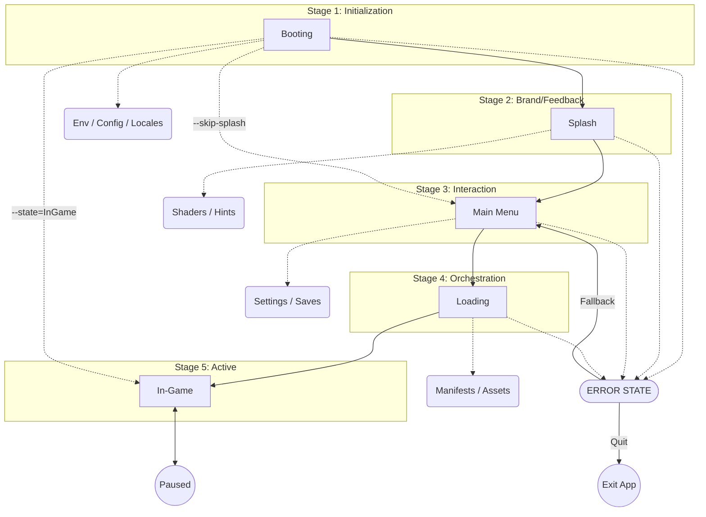

# Architecture Specification: Launching Module

## Overview

This document specifies the professional "Launching" module for the Planetarium game. It covers the complete application initialization sequence, including system health checks, branding, main menu orchestration, and asset loading.

## Launch Sequence Overview



## Design Principles

1. **State-Driven**: Every stage is a first-class `AppState`.
2. **Asynchronous Loading**: Critical operations (IO, Shader compilation) must not block the main thread.
3. **Visual Continuity**: Professional transitions (fades, vignettes) between all states.
4. **Resilience**: Graceful failure handling with user-friendly error states.
5. **User-Centric**: Respect player time (e.g., skippable splash screens after minimum feedback duration).

## Technical Architecture

### AppStates (Core FSM)

1. **Boot**:
    - **Environment Setup**: Determines platform-specific paths (e.g., `%APPDATA%` on Windows, `~/.local/share` on Linux) for logs and saves.
    - **Metadata Loading**: Loads static application info (App Name, Initial Window Title, Version, Description, Repository, Authors) from `Cargo.toml` via `AppMetadata` resource before engine initialization.
    - Loads and validates configuration files (`settings.toml`).
    - Initializes the window and rendering engine (Graphic API, Input, Audio).
    - **Diagnostics**: Initializes Bevy's `LogPlugin` and non-blocking analytics/telemetry.
2. **Splash**:
    - A sequential queue of branding videos/images.
    - Progressive loading of core UI textures in the background.
    - Mandatory legal screens (if required).
3. **MainMenu**:
    - The interactive hub (New Game, Load, Settings, Exit).
    - Background ambiance (static scene or dynamic 3D vignette).
    - Sub-menus (Settings, Save Slots) are rendered as children or modal overlaps within this state.
4. **Loading**:
    - Asset orchestration based on "bundles" (e.g., Stage 1 assets).
    - UI Feedback: Progress bar, loading hints/lore, and animated indicators.
5. **Error**:
    - Global exception handler state. Shows error details and provides a "Back to Menu" or "Exit" option.

### Plugins

- `BootPlugin`: Handles initial setup, update checks, and authentication logic.
- `SplashPlugin`: Manages the queue of splash screens, including progress indicators and hint systems.
- `MenuPlugin`: Core menu functionality and the settings sub-system.
- `LoadingPlugin`: Resource orchestration via manifest tags, progress tracking, and transition to the game.

### Bevy Implementation Details

#### Core Resources

- `struct LaunchConfig`: Global settings loaded during `Boot`.
- `struct LoadingTracker`: Tracks progress of current asset bundle batches.

#### Marker Components

- `struct SplashElement`: For entities specific to the Splash stage.
- `struct MenuUI`: For entities specific to the MainMenu stage.

#### Best Practices

- **Modular Plugins**: Every stage is an independent `Plugin`.
- **StateScoped Cleanup**: Use `OnExit` systems or `StateScoped` components to ensure no "leaking" entities between states.
- **Marker Components**: Use empty structs (e.g., `struct SplashScreen;`) to filter entities in systems.
- **Event-Driven UI**: UI updates respond to events (e.g., `VolumeChangedEvent`) rather than polling.

## Error Handling Strategy

- **Missing Assets**: Use hardcoded placeholders (e.g., a magenta square for textures) OR skip non-essential assets with a log warning.
- **State Transition Failures**: Log an `ERROR`, but attempt to fallback to the `MainMenu` instead of crashing.
- **Minimal MVP**: Avoid complex modal dialogs for non-critical errors; keep the flow moving.

## State-Driven Scene Management

1. **Finite State Machine (FSM)**: `AppState` acts as the application's "brain," controlling the lifecycle, memory cleanup (`OnExit`), and system scheduling.
2. **Scene Controller**: Each state manages its own data container (Scene).
    - Entering a state triggers the asynchronous loading of a specific scene (UI layouts, lighting, background assets).
    - Exiting a state ensures efficient resource unloading.
3. **Decoupling**: Logic (Rust systems) remains independent of visual presentation (Scene data).

## Asset Orchestration (AAA Approach)

- **Manifest File**: All game assets are defined in external manifests (e.g., `assets/assets.toml`).
- **Asset Bundles & Tagging**: Resources are grouped into logical bundles identified by tags.
- **Asynchronous Orchestration**: Processes tags requested by game logic and handles dependencies.
- **Optimized Loading**: Integration with asynchronous IO and support for pre-compiling GPU-ready data (shaders, textures).

### Localization (AAA Approach)

The system uses [Project Fluent](https://projectfluent.org/) for highly scalable and grammatically correct translations.

- **Pluralization & Grammar**: Native support for complex grammatical rules (e.g., Russian plurals).
- **Key-Based Access**: Code refers to unique identifiers (e.g., `menu-start-button`) instead of raw text.
- **Dynamic Content**: Support for variables (e.g., `welcome-user = Welcome, { $user }!`).
- **Audio Localization**: Support for regional audio files (voice-overs, etc.) stored within the locale structure.
- **Isolation & Fallback**: Each language lives in its own directory within `assets/locales/`. If a localized asset is missing, the system falls back to the default locale (English).

### Standard UI Audio Assets

To ensure consistent audio feedback, the following standard SFX set must be implemented:

- `click.ogg`: Standard button activation.
- `hover.ogg`: Focus change on interactive elements.
- `back.ogg`: Menu cancellation or navigation back.
- `error.ogg`: Triggered on invalid input or failure.
- `scroll.ogg`: Navigation through long lists or sliders.

---

## Technical File Structure

```text
assets/
├── locales/
│   ├── en-US/                  # English (United States)
│   │   ├── text/
│   │   │   ├── menu.ftl        # Fluent localization files
│   │   │   └── items.ftl
│   │   └── audio/              # Localized voice-overs/SFX
│   └── ru-RU/                  # Russian (Russia)
│       ├── text/
│       └── audio/
├── configs/
│   └── default.toml            # Shipping configuration template
├── textures/
│   └── brand/                  # Logo and branding assets
└── manifests/
    └── core.assets.toml        # Asset orchestrator definitions

src/
├── core/
│   ├── states.rs               # AppState enum definition
│   └── mod.rs
├── launcher/
│   ├── boot.rs                 # Plugin for stage 1
│   ├── splash.rs               # Plugin for stage 2
│   ├── menu/                   # Sub-module for stage 3
│   │   ├── widgets.rs          # Button, Slider, etc.
│   │   └── mod.rs
│   ├── loading.rs              # Plugin for stage 4
│   └── mod.rs                  # LauncherPlugin aggregate
└── ui/
    ├── theme.rs                # Color palettes, fonts
    └── mod.rs
```

## UI Framework (AAA Quality)

To maximize engine utilization, the module strictly uses **Bevy's built-in UI system** (`bevy_ui`):

- **Flexbox Positioning**: Layouts are managed using Taffy.
- **Interactivity**: Standard Bevy `Interaction` components.
- **Styling**: Data-driven styles for easy theming.

## Live Configuration (AAA Approach)

- **File Watchers**: Detects changes in `default.toml` and manifests.
- **Event-Driven Updates**: `ConfigChangedEvent` triggers reactive updates in Audio, Graphics, and UI systems immediately.

## Design Checklist (Ensuring AAA Feel)

| Requirement | Description |
| :--- | :--- |
| **No Hardcoded Paths** | Use the `AssetServer` or a custom path resolution service. |
| **Input Remapping** | Support for Keyboard/Mouse, Gamepad, and Touch (if applicable) through action-based inputs. |
| **Vignettes/Fades** | All UI transitions must be masked by professional camera effects or full-screen vignettes. |
| **High DPI Support** | UI must scale correctly according to the system's display scale factor. |
| **Save Integrity** | Check save slot data early (on entering the Load Menu) to prevent corrupted state crashes. |
| **Performance** | Instrument each stage with timers for internal analytics/optimization. |

## Logging Standards

Every module must provide clear diagnostic feedback using Bevy's logging macros.

- **[TAG]**: Every log should start with a plugin tag, e.g., `[BootPlugin]`.
- **Levels**:
  - `error!`: Critical failures (config missing, assets corrupted).
  - `warn!`: Fallbacks or non-critical missing items.
  - `info!`: State transitions and major milestones.
  - `debug!`: Performance data and fine-grained logic steps.

## Diagnostics

## What to Avoid

- **Long "Black Screens"**: Never leave the player without visual feedback or a progress indicator.
- **Blocking Operations**: Do not perform heavy IO or computations on the main rendering thread.
- **Forced Updates**: Avoid mandatory updates without a "Skip" or "Cancel" option, unless they are critical for security or compatibility.
- **Missing Navigation**: Ensure every sub-menu or settings screen has a clear "Back" or "Cancel" button.

## System Robustness & Developer Tools

To ensure a smooth development cycle and application stability, the following safety mechanisms and tools are provided:

- **Developer Backdoor (CLI & Shortcuts)**:
  - Support for `--skip-splash` to bypass branding screens during testing.
  - Command-line argument `--state=<StateName>` to jump directly to a specific state (e.g., `Gameplay`).
  - **Debug Overlay**: A state-independent diagnostic layer (e.g., via `F1` or `~`) that remains active across all `AppStates`, displaying FPS, memory usage, and logic logs.
- **Configuration Migration (Version Guard)**:
  - All config files (`settings.toml`) include a `version` field.
  - If a user has an older version of the config, the system performs a "non-destructive merge," adding missing fields from the default template while preserving user choices.
- **First-Run Orchestration**:
  - The `Boot` module detects if a configuration exists in the platform-specific data folder (e.g., `%APPDATA%`).
  - If absent, it auto-initializes the environment using templates from `assets/configs/`.
- **Asset Hardening**:
  - **Embedded Fallbacks**: Critical resources (error fonts, basic UI textures) are embedded into the executable using `include_bytes!` to ensure the game can at least display error messages if external assets are corrupted.
- **Global Event Bus**:
  - A centralized event system (e.g., `SystemEvent`) allows decoupled communication between plugins for high-level actions (`AppExit`, `ConfigReload`, `NetworkLost`).

## UI/UX Interaction Standards

For a professional "AAA feel," the following elements of interface "juiciness" should be implemented:

- **State Transitions**: Implement smooth fade-in/fade-out (alpha-blending) when switching between `AppState` scenes.
- **Splash Interaction**: Allow skipping any splash screen after a minimum of 1 second by pressing any key or clicking.
- **Informative Loading**: The progress bar must show a numerical percentage and the name of the current asset group being loaded.
- **Reactive UI**:
  - Buttons must have distinct hover and press animations (e.g., slight scaling or color shift).
  - Play subtle sound effects (SFX) on button hover and click.
- **Save/Load State**: The interaction logic for selecting slots and displaying metadata (Playtime, Date) must be handled within the `MenuPlugin`.

## User Stories

- **As a Developer**, I want to drop this module into a new project and have a working main menu and loading screen within minutes.
- **As a Player**, I want a smooth transition from clicking the executable to seeing the main menu.
- **As a Developer**, I want to easily add my own custom splash screen.
- **As a Game Designer**, I want to add new assets by simply editing a text manifest.

## Future Considerations

- Controller/Gamepad support for menus out of the box.
- Advanced procedural generation loading hooks.

## Backlog / Future Discussions

- [ ] Детальные настройки для 2D vs 3D (Pixel Perfect, LOD-ы и т.д.).
- [ ] Продвинутая темизация UI (средствами Bevy UI).
- [ ] Интерфейс переназначения управления.
