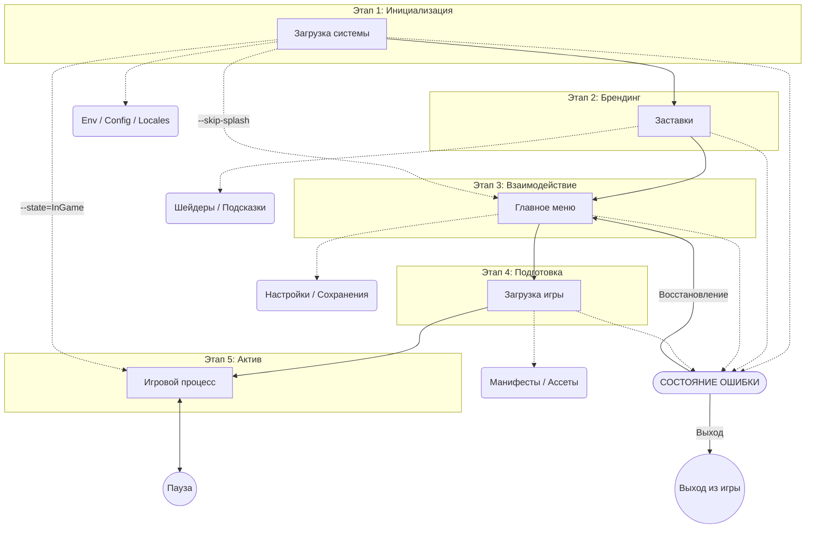

# Спецификация архитектуры: Модуль запуска (Launching)

## Обзор

Этот документ описывает профессиональный модуль «Загрузки» для игры Planetarium. Он охватывает полную последовательность инициализации приложения, включая проверки состояния системы, брендинг, оркестрацию главного меню и загрузку ресурсов.

## Обзор последовательности запуска



## Принципы проектирования

1. **Управление через состояния**: Каждый этап является полноценным `AppState`.
2. **Асинхронная загрузка**: Критические операции (ввод-вывод, компиляция шейдеров) не должны блокировать основной поток.
3. **Визуальная непрерывность**: Использование профессиональных переходов (затухания, виньетки) между всеми состояниями.
4. **Отказоустойчивость**: Корректная обработка ошибок с понятными пользователю состояниями.
5. **Ориентированность на пользователя**: Уважение времени игрока (например, возможность пропуска заставок после минимального времени отображения).

## Техническая архитектура

### Состояния приложения (Core FSM)

1. **Boot (Загрузка системы)**:
    - **Настройка окружения**: Определение путей к ресурсам и конфигам с учетом платформы (напр., `%APPDATA%` для Windows, `~/.local/share` для Linux) для логов и сохранений.
    - **Загрузка метаданных**: Считывание статической информации о приложении (Название игры, Начальный заголовок окна, Версия, Описание, Репозиторий, Авторы) из `Cargo.toml` через ресурс `AppMetadata` до полной инициализации движка.
    - Загрузка и валидация конфигурационных файлов (`settings.toml`).
    - Инициализация ядра движка (графический API, ввод, аудио, физика).
    - **Диагностика**: Инициализация `LogPlugin` и неблокирующих систем аналитики/телеметрии.
2. **Splash (Заставки)**:
    - Последовательная очередь брендовых видео или изображений.
    - Фоновая прогрессивная загрузка основных текстур интерфейса.
    - Отображение обязательных юридических экранов (при необходимости).
3. **MainMenu (Главное меню)**:
    - Интерактивный центр (Новая игра, Загрузка, Настройки, Выход).
    - Фоновая атмосфера (статичная сцена или динамическая 3D-виньетка).
    - Подменю (настройки, слоты сохранений) отображаются как дочерние элементы или модальные окна внутри этого состояния.
4. **Loading (Загрузка)**:
    - Оркестрация ресурсов на основе «пакетов» (напр., ресурсы первого уровня).
    - Обратная связь: прогресс-бар, игровые подсказки и анимированные индикаторы.
5. **Error (Ошибка)**:
    - Глобальное состояние обработки исключений. Показывает детали ошибки и предоставляет варианты «Вернуться в меню» или «Выйти».

### Плагины

- `BootPlugin`: Управляет начальной настройкой, проверкой обновлений и логикой аутентификации.
- `SplashPlugin`: Управляет очередью заставок, включая индикаторы прогресса и систему подсказок.
- `MenuPlugin`: Основной функционал меню и подсистема настроек.
- `LoadingPlugin`: Оркестрация ресурсов через теги манифеста, отслеживание прогресса и переход в игру.

### Детали реализации в Bevy

#### Основные ресурсы

- `struct LaunchConfig`: Глобальные настройки, загружаемые во время `Boot`.
- `struct LoadingTracker`: Отслеживает прогресс текущих очередей загрузки ассетов.

#### Маркерные компоненты

- `struct SplashElement`: Для сущностей, специфичных для этапа заставок.
- `struct MenuUI`: Для сущностей, специфичных для главного меню.

#### Лучшие практики

- **Модульные плагины**: Каждый этап — это независимый `Plugin`.
- **Очистка состояний (StateScoped)**: Использование систем `OnExit` или компонентов `StateScoped` для предотвращения «утечек» сущностей между состояниями.
- **Маркерные компоненты**: Использование пустых структур (напр., `struct SplashScreen;`) для фильтрации сущностей в системах.
- **Событийный UI**: Обновление интерфейса в ответ на события (напр., `VolumeChangedEvent`), а не через постоянный опрос (polling).

## Стратегия обработки ошибок

- **Отсутствие ассетов**: Использование жестко заданных заглушек (напр., ярко-розовый квадрат для текстур) ИЛИ пропуск второстепенных ассетов с записью предупреждения в лог.
- **Сбои переходов состояний**: Запись `ERROR` в лог и попытка вернуться в `MainMenu` вместо аварийного завершения.
- **Минимальный MVP**: Избегайте сложных модальных окон для некритичных ошибок; поддерживайте плавность игрового процесса.

## Управление сценами через состояния

1. **Конечный автомат (FSM)**: `AppState` выступает в роли «мозга» приложения, контролируя жизненный цикл, очистку памяти (`OnExit`) и планирование систем.
2. **Контроллер сцен**: Каждое состояние управляет собственным контейнером данных (Сценой).
    - Вход в состояние запускает асинхронную загрузку конкретной сцены (макеты UI, освещение, фоновые ассеты).
    - Выход из состояния обеспечивает эффективную выгрузку ресурсов.
3. **Делинеация**: Логика (системы Rust) остается независимой от визуального представления (данные Сцены).

## Оркестрация ассетов (AAA подход)

- **Файл манифеста**: Все игровые ассеты описаны во внешних манифестах (напр., `assets/assets.toml`).
- **Пакеты и теги**: Ресурсы сгруппированы в логические пакеты, идентифицируемые тегами.
- **Асинхронная оркестрация**: Обработка тегов, запрошенных игровой логикой, и управление зависимостями.
- **Оптимизированная загрузка**: Интеграция с асинхронным вводом-выводом и поддержка предварительной компиляции данных для GPU (шейдеры, текстуры).

### Локализация (AAA подход)

Система использует [Project Fluent](https://projectfluent.org/) для создания масштабируемых и грамматически правильных переводов.

- **Плюрализация и грамматика**: Нативная поддержка сложных грамматических правил (напр., русские формы множественного числа).
- **Доступ по ключам**: Код ссылается на уникальные идентификаторы (напр., `menu-start-button`), а не на сырой текст.
- **Динамический контент**: Поддержка переменных (напр., `welcome-user = Добро пожаловать, { $user }!`).
- **Локализация звука**: Поддержка региональных аудиофайлов (озвучка и т.д.), хранящихся внутри структуры локали.
- **Изоляция и Fallback**: Каждый язык живет в собственной директории внутри `assets/locales/`. При отсутствии локализованного ассета система откатывается к основной локали (English).

### Стандартные аудио-ассеты интерфейса

Для обеспечения консистентной аудио-отдачи должен быть реализован следующий набор SFX:

- `click.ogg`: Активация стандартной кнопки.
- `hover.ogg`: Изменение фокуса на интерактивных элементах.
- `back.ogg`: Отмена или переход назад в меню.
- `error.ogg`: Срабатывает при неверном вводе или ошибке.
- `scroll.ogg`: Навигация по длинным спискам или слайдерам.

---

## Техническая структура файлов

```text
assets/
├── locales/
│   ├── en-US/                  # Английский (США)
│   │   ├── text/
│   │   │   ├── menu.ftl        # Файлы локализации Fluent
│   │   │   └── items.ftl
│   │   └── audio/              # Локализованная озвучка/SFX
│   └── ru-RU/                  # Русский (Россия)
│       ├── text/
│       └── audio/
├── configs/
│   └── default.toml            # Шаблон конфигурации для поставки
├── textures/
│   └── brand/                  # Логотипы и брендовые ассеты
└── manifests/
    └── core.assets.toml        # Определения для оркестратора ассетов

src/
├── core/
│   ├── states.rs               # Определение AppState
│   └── mod.rs
├── launcher/
│   ├── boot.rs                 # Плагин для Этапа 1
│   ├── splash.rs               # Плагин для Этапа 2
│   ├── menu/                   # Подмодуль для Этапа 3
│   │   ├── widgets.rs          # Кнопки, слайдеры и т.д.
│   │   └── mod.rs
│   ├── loading.rs              # Плагин для Этапа 4
│   └── mod.rs                  # Агрегатор LauncherPlugin
└── ui/
    ├── theme.rs                # Цветовые палитры, шрифты
    └── mod.rs
```

## UI Фреймворк (AAA качество)

Для максимального использования возможностей движка модуль строго использует **встроенную UI-систему Bevy** (`bevy_ui`):

- **Позиционирование Flexbox**: Макеты управляются через Taffy.
- **Интерактивность**: Стандартные компоненты `Interaction` от Bevy.
- **Стилизация**: Стили на основе данных для легкой темизации.

## Живая конфигурация (AAA подход)

- **Наблюдатели файлов**: Обнаружение изменений в `default.toml` и манифестах.
- **Событийное обновление**: `ConfigChangedEvent` немедленно запускает реактивные обновления в системах аудио, графики и интерфейса.

## Контрольный список проектирования (Ensuring AAA Feel)

| Требование | Описание |
| :--- | :--- |
| **Нет «зашитых» путей** | Используйте `AssetServer` или кастомный сервис разрешения путей. |
| **Переназначение ввода** | Поддержка клавиатуры/мыши, геймпада и сенсорного ввода через систему действий (action-based). |
| **Виньетки/Затухания** | Все переходы UI должны сопровождаться профессиональными эффектами камеры. |
| **Поддержка High DPI** | Интерфейс должен корректно масштабироваться в соответствии с системным коэффициентом масштабирования. |
| **Целостность сохранений** | Проверяйте данные слотов сохранения заранее (при входе в меню загрузки). |
| **Производительность** | Снабдите каждый этап таймерами для внутренней аналитики и оптимизации. |

## Стандарты логирования

Каждый модуль должен предоставлять четкую диагностическую обратную связь, используя макросы логирования Bevy.

- **[ТЕГ]**: Каждый лог должен начинаться с тега плагина, напр., `[BootPlugin]`.
- **Уровни**:
  - `error!`: Критические сбои (конфиг отсутствует, ассеты повреждены).
  - `warn!`: Использование стандартных значений (fallbacks) или отсутствие некритичных элементов.
  - `info!`: Смена состояний и важные этапы работы.
  - `debug!`: Данные о производительности и детальные шаги логики.

## Диагностика

## Чего избегать

- **Длительных «чёрных экранов»**: Никогда не оставляйте игрока без визуальной обратной связи или индикатора прогресса.
- **Блокирующих операций**: Не выполняйте тяжелые операции ввода-вывода или вычисления в основном потоке рендеринга.
- **Принудительных обновлений**: Избегайте обязательных обновлений без возможности отмены или пропуска (за исключением критических патчей безопасности/совместимости).
- **Отсутствия навигации**: Каждое подменю или экран настроек должны иметь четкую кнопку «Назад» или «Отмена».

## Надежность системы и инструменты разработчика

Для обеспечения плавного цикла разработки и стабильности приложения предусмотрены следующие «защитные механизмы» и инструменты:

- **Инструменты разработчика (CLI и горячие клавиши)**:
  - Поддержка `--skip-splash` для пропуска заставок при тестировании.
  - Аргумент командной строки `--state=<StateName>` для прямого перехода в нужное состояние (напр. в игру).
  - **Debug Overlay**: Слой диагностики, не зависящий от текущего состояния (State-independent, вызывается по `F1` или `~`), отображающий FPS, использование памяти и системные логи поверх любого экрана.
- **Миграция конфигурации (Version Guard)**:
  - Все файлы настроек (`settings.toml`) содержат поле `version`.
  - При обнаружении устаревшей версии конфига система выполняет «неразрушающее слияние», добавляя новые доступные поля и сохраняя выбор пользователя.
- **Логика первого запуска**:
  - Модуль `Boot` проверяет наличие настроек в системной папке данных (напр. `%APPDATA%`).
  - Если файлы отсутствуют, система автоматически инициализирует окружение на основе шаблонов из `assets/configs/`.
- **Отказоустойчивость ресурсов**:
  - **Вшитые ресурсы (Embedded)**: Критически важные ассеты (шрифт для ошибок, базовые текстуры кнопок) вшиваются в бинарный файл через `include_bytes!`, чтобы игра могла отобразить причину поломки даже при повреждении папок с ассетами.
- **Глобальная шина событий (Global Event Bus)**:
  - Централизованная система событий (напр. `SystemEvent`) позволяет модулям общаться без жестких связей (события `AppExit`, `ConfigReload`, `SystemAlert`).

## Стандарты взаимодействия (UI/UX)

Для достижения профессионального уровня («AAA feel») должны быть реализованы следующие элементы «сочности» интерфейса:

- **Переходы между состояниями**: Плавное появление и затухание (fade-in/fade-out) при смене `AppState`.
- **Пропуск заставок**: Возможность пропустить любую заставку через 1 секунду после начала нажатием любой клавиши или кликом.
- **Информативная загрузка**: Прогресс-бар должен отображать числовой процент и название текущей группы загружаемых ассетов.
- **Реактивность интерфейса**:
  - Кнопки должны иметь анимации при наведении и нажатии (напр., легкое масштабирование или изменение цвета).
  - Звуковые эффекты (SFX) при наведении на элементы и кликах.
- **Сохранение/Загрузка**: Логика выбора слотов и отображение метаданных (время игры, дата) реализуется внутри `MenuPlugin`.

## Пользовательские истории

- **Как разработчик**, я хочу подключить этот модуль и получить рабочее меню за минуты.
- **Как игрок**, я хочу видеть плавный переход от старта до главного меню.
- **Как разработчик**, я хочу легко добавлять свои заставки.
- **Как геймдизайнер**, я хочу добавлять ассеты через текстовый манифест.

## Будущие доработки

- Поддержка контроллеров/геймпадов.
- Продвинутые хуки для загрузки процедурно-генерируемого контента.

## Заметки для будущих обсуждений (Backlog)

- [ ] Детальные настройки для 2D vs 3D (Pixel Perfect, LOD-ы и т.д.).
- [ ] Продвинутая темизация UI (средствами Bevy UI).
- [ ] Интерфейс переназначения управления.
