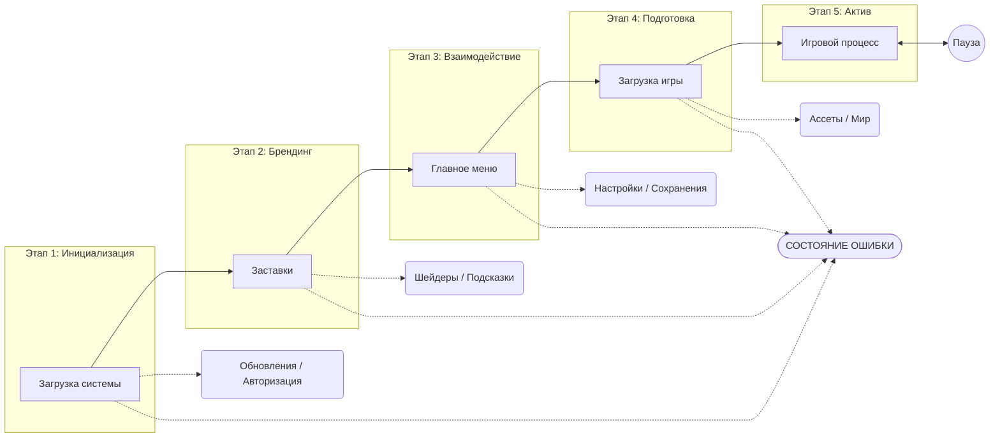

# Спецификация модуля запуска (Launching Module)

## Обзор

Модуль запуска представляет собой универсальный модульный шаблон для игр на движке Bevy. Он управляет начальными этапами приложения: от самого первого кадра до момента входа игрока в игровой мир.

Основная цель — предоставить стандартизированную структуру, которую можно легко переиспользовать в различных проектах (как 2D, так и 3D), сохраняя строгое разделение между системной логикой запуска и контентом конкретной игры.

## Обзор последовательности запуска



## Принципы проектирования

- **Модульность**: Реализовано как набор плагинов Bevy.
- **Управление состояниями**: Использует `States` Bevy для управления переходами между фазами.
- **Расширяемость**: Основные компоненты легко переопределяются или расширяются без изменения внутренней логики модуля.
- **Универсальная поддержка**: Базовая логика не зависит от типа рендеринга (2D или 3D). Компоненты интерфейса (Меню/Настройки) адаптируются под требования проекта.
- **Приоритет стандартных средств (Core-First)**: Максимальное использование стандартной библиотеки движка Bevy. Сторонние библиотеки подключаются только в случае отсутствия необходимого функционала в ядре движка.

## Последовательность запуска

Модуль управляет следующими состояниями:

1. **Boot (Загрузка системы)**:
    - **Настройка окружения**: Определение путей к ресурсам и конфигам с учетом платформы (напр., `%APPDATA%` для Windows, `~/.local/share` для Linux) для логов и сохранений.
    - Загрузка и валидация конфигурационных файлов (`settings.toml`).
    - Инициализация ядра движка (графический API, ввод, аудио, физика).
    - **Диагностика**: Инициализация `LogPlugin` и неблокирующих систем аналитики/телеметрии.
    - **Обновления и целостность**: Проверка версии на сервере и фоновая проверка целостности файлов (хэши).
    - **Аутентификация**: Вход пользователя или восстановление сессии.
    - **Предкомпиляция шейдеров**: Загрузка и сборка необходимых шейдеров.
    - **Локализация**: Загрузка выбранных языковых файлов до входа в меню.
2. **Splash (Заставки)**:
    - Отображение последовательности заставок (лицензионные требования движка, студия, партнеры).
    - **Переходы**: Поддержка плавного появления и исчезновения (fade-in/fade-out).
    - **Фоновые задачи**: Продолжение неблокирующей подготовки данных (например, проверка больших манифестов ассетов).
    - **Прогресс и обратная связь**: Возможность видеть прогресс загрузки следующего состояния и случайные игровые советы/подсказки.
3. **MainMenu (Главное меню)**:
    - Стандартный интерфейс с разделами:
        - **Играть**: Выбор режима (Кампания, Мультиплеер, Песочница).
        - **Новая игра**: Создание профиля и выбор начального слота.
        - **Загрузить игру**: Список сохранений с визуальным превью и метаданными.
        - **Настройки**: Полный GUI для всех параметров (Графика, Звук, Управление, Язык).
        - **Дополнительно**: Достижения, Авторы или Магазин (при наличии).
        - **Выход**: Корректное завершение работы.
    - **Управление сохранениями**: Проверка целостности и метаданных слотов перед входом в меню «Загрузить игру».
    - **Адаптивный интерфейс**: Меню и настройки динамически меняют свой состав в зависимости от типа игры (2D или 3D).
    - **Расширяемость**: Конструкция позволяет легко добавлять/удалять пункты меню и менять стилизацию.
4. **Loading (Загрузка игры)**:
    - Асинхронная загрузка ассетов, необходимых для игрового мира или уровня.
    - Отображение детального прогресс-бара и статуса текущей задачи.
    - Переход в состояние `InGame`, когда все критические ресурсы готовы.

## Техническая архитектура

### Машина состояний

`AppState` (Перечисление):

- `Booting`: Системная инициализация, обновления и авторизация.
- `Splash`: Последовательность брендовых экранов.
- `MainMenu`: Взаимодействие и настройка.
- `Loading`: Подготовка игровых ресурсов.
- `Error`: Состояние критической ошибки (выводит сообщение и варианты: выход/повтор).
- `InGame`: Активный геймплей (управляется внешней логикой игры).

### Плагины

- `BootPlugin`: Начальная настройка, проверка обновлений и логика аутентификации.
- `SplashPlugin`: Управление очередью заставок, индикаторами прогресса и системой подсказок.
- `MenuPlugin`: Основной функционал меню и подсистема настроек.
- `LoadingPlugin`: Оркестрация ресурсов через теги манифеста, отслеживание прогресса и переход в игру.

### Технические детали реализации в Bevy

#### Основные ресурсы

| Ресурс | Назначение |
| ------ | ---------- |
| `GameSettings` | Конфигурация графики, звука и управления, инициализированная из TOML. |
| `SplashTimer` | Таймер для автоматического перехода между заставками. |
| `LoadingAssets` | Отслеживание коллекции `Handle<T>` для расчета прогресса загрузки. |

#### Компоненты-маркеры (Управление состояниями)

| Маркер | Назначение | Стратегия очистки |
| ------ | ---------- | ----------------- |
| `SplashScreen` | Сущности, видимые во время Этапа 2. | Удаление по `OnExit(AppState::Splash)`. |
| `MainMenuRoot` | Корневой узел интерфейса главного меню. | Удаление по `OnExit(AppState::MainMenu)`. |
| `SettingsScreen` | Корневой узел интерфейса настроек. | Удаление по `OnExit(AppState::MainMenu)`. |
| `LoadingScreen` | Элементы UI прогресс-бара и подсказок. | Удаление по `OnExit(AppState::Loading)`. |
| `GameplayCamera` | Основная игровая камера (3D или 2D). | Очистка по `OnExit(AppState::InGame)`. |

#### Лучшие практики

- **Модульные плагины**: Каждый этап — это независимый `Plugin`.
- **Очистка через состояния**: Использование систем `OnExit` или компонентов `StateScoped` для предотвращения «утечек» сущностей между экранами.
- **Компоненты-маркеры**: Использование пустых структур (напр., `struct SplashScreen;`) для фильтрации сущностей в запросах (Queries).
- **Событийный UI**: Интерфейс реагирует на события (напр., `VolumeChangedEvent`), а не проверяет состояние каждый кадр (polling).

## Стратегия обработки ошибок

- **Отсутствующие ассеты**: Использование «заглушек» (напр., ярко-розовая текстура) ИЛИ пропуск второстепенных ресурсов с записью в лог.
- **Ошибки переходов**: Запись `ERROR` в лог, но попытка возврата в `MainMenu` вместо полного краша приложения.
- **Минимализм MVP**: Избегание блокирующих диалоговых окон для некритичных ошибок на ранних этапах.

## Управление сценами через состояния (State-Driven Scene Management)

Проект следует стандарту «Профессионального игрового цикла», разделяя логику и данные с помощью **Состояний Bevy** и **Сцен**:

1. **Конечный автомат (FSM)**: `AppState` выступает в роли «мозга» приложения, контролируя жизненный цикл, очистку памяти (`OnExit`) и планирование работы систем.
2. **Scene Controller**: Каждое состояние управляет собственным контейнером данных (Сценой).
    - Вход в состояние инициирует асинхронную загрузку соответствующей сцены (макеты UI, освещение, фоновые ассеты).
    - Выход из состояния гарантирует эффективную выгрузку ресурсов.
3. **Разделение ответственности**: Логика (системы Rust) остается независимой от визуального представления (данные Сцены).

## Оркестрация ассетов (AAA подход)

Модуль использует **систему управления ассетами на основе манифестов**:

- **Файл манифеста**: Все игровые ресурсы описаны во внешних манифестах (например, `assets/assets.toml`).
- **Пакеты и теги**: Ресурсы сгруппированы в логические пакеты по тегам.
- **Асинхронная оркестрация**: Обработка тегов, запрошенных игрой, и автоматическое управление зависимостями.
- **Оптимизированная загрузка**: Интеграция с асинхронным вводом-выводом и поддержка предварительной подготовки данных для GPU (шейдеры, текстуры).

## Предлагаемая структура файлов

В проектах Bevy важно разделять **статический контент** (корневая папка assets) и **исходный код** (папка src):

### Корневая структура проекта

```plaintext
. (Корень проекта)
├── assets/                 # СТАТИЧЕСКИЙ КОНТЕНТ (Физические файлы)
│   ├── images/             # Текстуры, спрайты, иконки
│   ├── fonts/              # Шрифты (.ttf, .otf)
│   ├── audio/              # Звуки и музыка
│   ├── shaders/            # Кастомные шейдеры (GLSL/WGSL)
│   └── configs/            # assets.toml, default.toml
├── src/                    # ИСХОДНЫЙ КОД (Rust файлы)
├── tests/                  # Интеграционные тесты
├── docs/                   # Документация проекта и дизайн-спецификации
├── Cargo.toml
└── ...
```

### Детализация исходного кода (src/)

```plaintext
src/
├── main.rs                 # Минимальная точка входа (сборка приложения)
├── lib.rs                  # Корень библиотеки, регистрация основных плагинов
├── launcher/               # САМ МОДУЛЬ (Переиспользуемый шаблон)
│   ├── mod.rs              # LauncherPlugin (агрегирует все под-плагины)
│   ├── boot.rs             # Этап 1: Логи, Конфиг, Авторизация, Обновления
│   ├── splash.rs           # Этап 2: Последовательность заставок, подсказки
│   ├── menu/               # Этап 3: UI и взаимодействие
│   │   ├── mod.rs
│   │   ├── main_menu.rs    # Логика главного меню
│   │   └── settings.rs     # GUI и логика настроек
│   ├── loading.rs          # Этап 4: Оркестрация ассетов
│   └── systems/            # Внутренние общие системы модуля
├── game/                   # Логика конкретного проекта (Мир игры)
│   ├── mod.rs
│   └── gameplay.rs         # Основные состояния игрового процесса
├── ui/                     # Общий UI фреймворк
│   ├── mod.rs
│   ├── widgets.rs          # Стилизованные кнопки, слайдеры, панели
│   └── theme.rs            # Токены дизайна (Цвета, Шрифты, Размеры)
├── core/                   # Глобальные определения
│   ├── mod.rs
│   ├── states.rs           # Определения AppState и SubStates
│   └── resources.rs        # Глобальные настройки и общие данные
└── assets/                 # Rust-код для управления ассетами
    ├── mod.rs
    └── manifest.rs         # Логика интерпретации манифестов
```

## UI Фреймворк

Чтобы минимизировать зависимости, модуль строго использует **встроенную UI-систему Bevy** (`bevy_ui`):

- **Позиционирование Flexbox**: Макеты управляются через Taffy.
- **Интерактивность**: Стандартные компоненты Bevy `Interaction`.
- **Стилизация**: Описательные стили для легкой смены тем.

## Живая конфигурация (AAA подход)

Поддержка обновления настроек без перезапуска через **Hot-Reloading**:

- **File Watchers**: Наблюдение за изменениями в `default.toml` и манифестах.
- **Событийное обновление**: `ConfigChangedEvent` мгновенно уведомляет системы звука, графики и интерфейса.

## Технические рекомендации по реализации

| Аспект | Рекомендация |
| ------ | ------------ |
| **Загрузка ресурсов** | Использовать асинхронную загрузку с кэшированием; не блокировать основной поток. |
| **Прерывание** | Возможность выхода через [Alt+F4] или системные кнопки на любом этапе. |
| **Оффлайн-режим** | Корректная работа ядра игры без интернета. |
| **Локализация** | Полная загрузка языковых файлов до перехода в `MainMenu`. |
| **Сохранения** | Ранняя проверка целостности данных сохранений (при входе в меню загрузки). |
| **Производительность** | Использование таймеров для аналитики и оптимизации каждого этапа. |

## Диагностика и логирование

Модуль использует встроенную систему логирования Bevy (на базе библиотеки `tracing`) для обеспечения прозрачности работы и упрощения отладки:

- **Уровни логирования**:
  - `ERROR`: Критические сбои (напр., «Ошибка компиляции шейдеров», «Конфиг поврежден»).
  - `WARN`: Неблокирующие проблемы (напр., «Сервер обновлений недоступен», «Отсутствует необязательный ассет»).
  - `INFO`: Ключевые этапы (напр., «Вход в MainMenu», «Авторизация успешна»).
  - `DEBUG`: Подробности внутренних процессов (напр., «Манифест загружен за 14мс»).
- **Цели вывода**:
  - **Консоль**: Вывод в реальном времени во время разработки.
  - **Файл лога**: Автоматическое сохранение в локальную папку пользователя для анализа ошибок в релизных версиях.
- **Контекст**: Каждый лог содержит метку времени и имя плагина-источника (напр., `[BootPlugin]`).

## Чего избегать

- **Длительных «чёрных экранов»**: Никогда не оставляйте игрока без визуальной обратной связи или индикатора прогресса.
- **Блокирующих операций**: Не выполняйте тяжелые операции ввода-вывода или вычисления в основном потоке рендеринга.
- **Принудительных обновлений**: Избегайте обязательных обновлений без возможности отмены или пропуска (за исключением критических патчей безопасности/совместимости).
- **Отсутствия навигации**: Каждое подменю или экран настроек должны иметь четкую кнопку «Назад» или «Отмена».

## Стандарты взаимодействия (UI/UX)

Для достижения профессионального уровня («AAA feel») должны быть реализованы следующие элементы «сочности» интерфейса:

- **Переходы между состояниями**: Плавное появление и затухание (fade-in/fade-out) при смене `AppState`.
- **Пропуск заставок**: Возможность пропустить любую заставку через 1 секунду после начала нажатием любой клавиши или кликом.
- **Информативная загрузка**: Прогресс-бар должен отображать числовой процент и название текущей группы загружаемых ассетов.
- **Реактивность интерфейса**:
  - Кнопки должны иметь анимации при наведении и нажатии (напр., легкое масштабирование или изменение цвета).
  - Звуковые эффекты (SFX) при наведении на элементы и кликах.
- **Сохранение/Загрузка**: Логика выбора слотов и отображение метаданных (время игры, дата) реализуется внутри `MenuPlugin`.

## Пользовательские истории

- **Как разработчик**, я хочу подключить этот модуль и получить рабочее меню за минуты.
- **Как игрок**, я хочу видеть плавный переход от старта до главного меню.
- **Как разработчик**, я хочу легко добавлять свои заставки.
- **Как геймдизайнер**, я хочу добавлять ассеты через текстовый манифест.

## Будущие доработки

- Поддержка локализации.
- Поддержка контроллеров/геймпадов.
- Постоянное хранение настроек.

## Заметки для будущих обсуждений (Backlog)

- [ ] Детальные настройки для 2D vs 3D (Pixel Perfect, LOD-ы и т.д.).
- [ ] Продвинутая темизация UI (средствами Bevy UI).
- [ ] Стратегия обработки ошибок (локальные и глобальные).
- [ ] Интерфейс переназначения управления.
