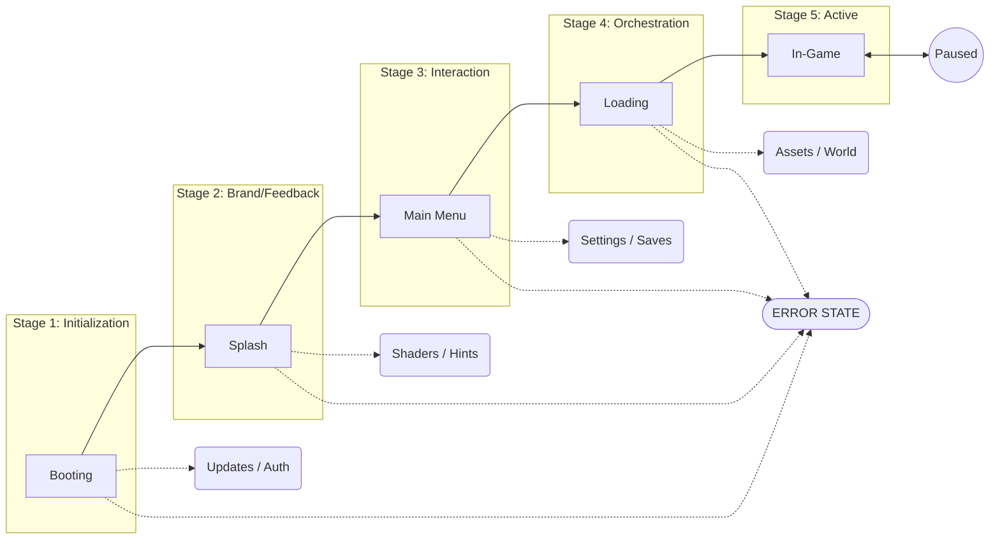

# Launching Module Specification

## Overview

The Launching Module is designed as a universal, modular template for Bevy games. It handles the initial stages of a game application, from the very first frame to the moment the player enters the game world.

The primary goal is to provide a standardized structure that can be easily reused across different projects (both 2D and 3D) while maintaining a strict separation between the platform/launch logic and the specific game content.

## Launch Sequence Overview

## Design Principles

- **Modularity**: Implemented as a set of Bevy Plugins.
- **State-Driven**: Uses Bevy's `States` to manage transitions between phases.
- **Extensibility**: Core components should be easy to override or extend without modifying the module's core logic.
- **Generic Support**: Core logic is agnostic to 2D or 3D rendering. UI components (Menu/Settings) are designed to be adaptable or conditional based on the project's requirements.
- **Core-First Approach**: Maximize use of Bevy's standard library. Third-party plugins are only introduced when required functionality is absent from the engine's core.

## Launching Sequence

The module manages the following states:

1. **Boot**:
    - Loads and validates configuration files (TOML/JSON).
    - Initializes the window and rendering engine.
    - **Diagnostics**: Initializes Bevy's `LogPlugin` and system performance monitors.
    - Sets up global resources (logger, file sinks, etc.).
    - **Update Check**: Verifies if a newer version of the application is available.
    - **Authentication**: Handles user login/session restoration if required.
    - **Shader Pre-compilation**: Loads and compiles necessary shaders.
    - **Localization**: Loads selected language files (ISO 639-1) before entering the menu.
2. **Splash**:
    - Displays a sequence of splash screens (e.g., Engine, Studio, Partners).
    - **Transitions**: Support for smooth fade-in/fade-out between screens.
    - **Progress & Feedback**: Ability to see loading progress for the next state and random gameplay tips/hints.
3. **MainMenu**:
    - Provides a standard UI for "Start Game", "Settings", "Credits", and "Exit".
    - **Comprehensive Settings**: Includes a ready-to-use GUI for all options defined in `default.toml`.
    - **Save Management**: Verifies save slot integrity and metadata before enabling "Load Game".
    - **Adaptive UI**: The menu and settings dynamically adjust their content based on whether the game is 2D or 3D.
    - **Extensibility**: Design allows easy addition/removal of menu items and re-styling of the UI.
4. **Loading**:
    - Handles asynchronous loading of assets required for the main game world/level.
    - Displays a detailed loading bar and current task status.
    - Transitions to the `InGame` state once all critical assets are ready.

## Technical Architecture

### State Machine

`AppState` (Enumeration):

- `Booting`: System initialization, updates, and auth.
- `Splash`: Sequence of brand screens.
- `MainMenu`: Interaction and configuration.
- `Loading`: Preparing game assets.
- `Error`: Critical failure state (shows error message and exit/retry options).
- `InGame`: Active gameplay (Handled by external game logic).

### Plugins

- `BootPlugin`: Handles initial setup, update checks, and authentication logic.
- `SplashPlugin`: Manages the queue of splash screens, including progress indicators and hint systems.
- `MenuPlugin`: Core menu functionality and the settings sub-system.
- `LoadingPlugin`: Resource orchestration via manifest tags, progress tracking, and transition to the game.

## State-Driven Scene Management

The project follows the "Professional Game Loop" standard, separating logic from data using **Bevy States** and **Scenes**:

1. **Finite State Machine (FSM)**: `AppState` acts as the application's "brain," controlling the lifecycle, memory cleanup (`OnExit`), and system scheduling.
2. **Scene Controller**: Each state manages its own data container (Scene).
    - Entering a state triggers the asynchronous loading of a specific scene (UI layouts, lighting, background assets).
    - Exiting a state ensures efficient resource unloading.
3. **Decoupling**: Logic (Rust systems) remains independent of visual presentation (Scene data).

## Asset Orchestration (AAA Approach)

The module employs a **Manifest-Driven Asset Management** system:

- **Manifest File**: All game assets are defined in external manifests (e.g., `assets/assets.toml`).
- **Asset Bundles & Tagging**: Resources are grouped into logical bundles identified by tags.
- **Asynchronous Orchestration**: Processes tags requested by game logic and handles dependencies.
- **Optimized Loading**: Integration with asynchronous IO and support for pre-compiling GPU-ready data.

## UI Framework

To maximize engine utilization, the module strictly uses **Bevy's built-in UI system** (`bevy_ui`):

- **Flexbox Positioning**: Layouts are managed using Taffy.
- **Interactivity**: Standard Bevy `Interaction` components.
- **Styling**: Data-driven styles for easy theming.

## Live Configuration (AAA Approach)

Professional engines support mid-game updates without restart via **Hot-Reloading**:

- **File Watchers**: Detects changes in `default.toml` and manifests.
- **Event-Driven Updates**: `ConfigChangedEvent` triggers reactive updates in Audio, Graphics, and UI systems immediately.

## Technical Implementation Guidelines

| Aspect | Recommendation |
| ------ | -------------- |
| **Asset Loading** | Use asynchronous loading with caching; never block the main rendering thread. |
| **Interruption** | Allow exit via [Alt+F4] or system buttons at any stage except initial engine setup. |
| **Offline Mode** | Ensure the core game is playable without internet. |
| **Localization** | Language files must be loaded and ready before the MainMenu state. |
| **Save Integrity** | Check save slot data early to prevent corrupted state crashes. |
| **Performance** | Instrument each stage with timers for internal analytics/optimization. |

## Diagnostics & Logging

The module leverages Bevy's built-in logging system (powered by the `tracing` crate) to ensure transparency and ease of debugging:

- **Log Levels**:
  - `ERROR`: Critical failures (e.g., "Failed to compile essential shaders", "Config file corrupted").
  - `WARN`: Non-blocking issues (e.g., "Update server unreachable", "Optional asset missing").
  - `INFO`: Significant milestones (e.g., "Entering MainMenu", "Authentication successful").
  - `DEBUG`: Detailed internal steps (e.g., "Loaded asset manifest in 14ms").
- **Output Targets**:
  - **Console**: Real-time feedback during development.
  - **File Log**: Automatically saved to the user's local data folder for troubleshooting production issues.
- **Contextual Data**: All logs include timestamps and the name of the originating plugin (e.g., `[BootPlugin]`).

## What to Avoid

- **Long "Black Screens"**: Never leave the player without visual feedback or a progress indicator.
- **Blocking Operations**: Do not perform heavy IO or computations on the main rendering thread.
- **Forced Updates**: Avoid mandatory updates without a "Skip" or "Cancel" option, unless they are critical for security or compatibility.
- **Missing Navigation**: Ensure every sub-menu or settings screen has a clear "Back" or "Cancel" button.

## User Stories

- **As a Developer**, I want to drop this module into a new project and have a working main menu and loading screen within minutes.
- **As a Player**, I want a smooth transition from clicking the executable to seeing the main menu.
- **As a Developer**, I want to easily add my own custom splash screen.
- **As a Game Designer**, I want to add new assets by simply editing a text manifest.

## Future Considerations

- Support for localization.
- Controller/Gamepad support for menus out of the box.
- Persistent user settings.

## Backlog / Future Discussions

- [ ] Detailed 2D vs 3D specific settings (Pixel Perfect, LODs, etc.).
- [ ] Advanced UI theming and skinning (using only Bevy UI).
- [ ] Error Handling strategy (Local vs Global errors).
- [ ] Controller/Gamepad remapping interface.
